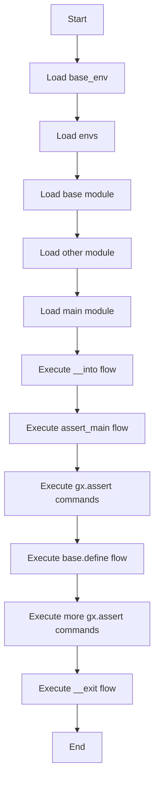

# Assert 示例

## 示例代码

```rust
extern mod os { path= "../../_gal/mods"; }
mod base_env {
    env _common {
      gx.vars {
        DOMAIN    = "domain" ;
      }
    }
    env cli : _common {
      ROOT   = "./";

    }
    env unit_test : _common {
      ROOT   = "./example";
    }
}
mod envs : base_env {
    #[usage(desp="default")]
    env default : cli ;
    env empty {}
    env ut : unit_test  ;
}
mod base{
  mod_val = "1";
  flow define {
    base = "BASE";
  }
  #[auto_load(entry)]
  flow base_into  {
    base_begin = "BASE_INTO";
  }
  #[auto_load(exit)]
  flow base_exit {
    base_end = "BASE_EXIT";
  }
}
mod other {
  flow def1 {
    other_val = "OTHER_DEF";
  }
  flow def2{
    other_val = "OTHER_DEF2";
  }
}
mod main   {
  conf = "${ENV_ROOT}/conf" ;

  #[auto_load(entry)]
  flow __into  | other.def1  {
    other_val = "OTHER_DE1";
  }
  #[auto_load(exit)]
  flow __exit | other.def2 ;
  #[usage(desp="main")]
  flow assert_main {
    one= "one";
    sys_a = { mod1 : "A", mod2 : "B" };
    sys_b =  [ "C", "D" ];
    sys_c = ${SYS_B[1]} ;
    sys_d = ${SYS_A.MOD1} ;
    gx.assert ( value : "${MAIN_CONF}" , expect : "${ENV_ROOT}/conf" );
    gx.assert ( value : "${OTHER_VAL}" , expect : "OTHER_DEF" );
    gx.assert ( value : "${SYS_A.MOD1}" , expect : "A" );
    gx.assert ( value : "${sys_a.mod1}" , expect : "A" );
    gx.assert ( value : "${sys_b[0]}" , expect : "C" );
    gx.assert ( value : "${sys_d}" , expect : "A" );
  }

  flow base.define | @assert_parent   {
    gx.assert ( value : "${MAIN_CONF}" , expect : "${ENV_ROOT}/conf" );
    gx.assert ( value : "${BASE_MOD_VAL}" , expect : "1" );
    gx.assert ( value : "${OTHER_VAL}" , expect : "OTHER_DEF" );
    gx.assert ( value : "${BASE}" , expect : "BASE" );
    gx.assert ( value : "${BASE_BEGIN}" , expect : "BASE_INTO" );
  }

}
```

## 说明

这个示例展示了如何使用 `gx.assert` 命令进行断言检查。在 `assert_main` 流程中，多个 `gx.assert` 命令用于验证变量的值是否符合预期。在 `base.define` 流程中，也使用了 `gx.assert` 来验证环境变量和模块变量的值。

