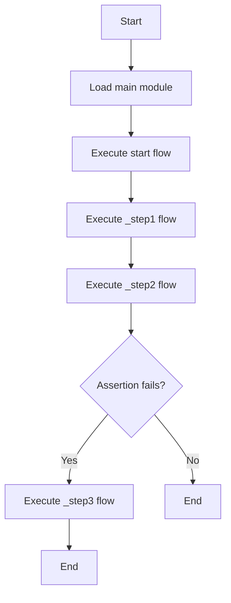

# Dryrun Example

This example demonstrates the dryrun functionality in GXL.

```rust
mod main {

env default {}

flow _step1 {
    gx.echo ("step1");
}

#[dryrun(_step3)]
flow _step2 {
    gx.echo ("step2");
    gx.assert ( value : "true" , expect : "false" );
}

flow _step3 {
    gx.echo ("dryrun setp2");
}

flow start | _step1 | _step2 ;

}
```

