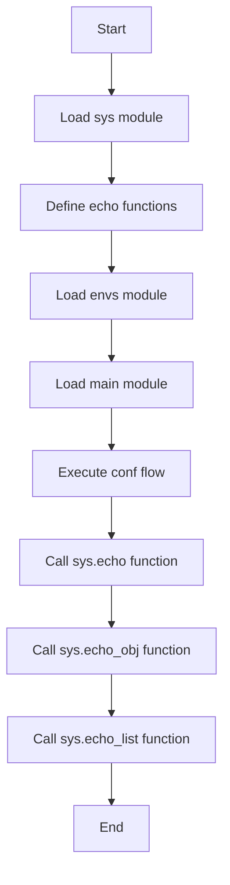

# Fun Example

This example demonstrates how to define and use functions in GXL.

```rust
extern mod os { path = "../../_gal/mods"; }

mod sys {
    fun echo(name) {
        gx.echo("echo:${name}");
    }
    fun echo_obj(obj) {
        gx.echo("echo_obj:${obj}");
    }
    fun echo_list(list) {
        gx.echo("echo_list:${list}");
    }
}

mod envs {
    env default {
        DATA = [
            "JAVA",
            "RUST",
            "PYTHON",
        ];
        OBJ = {
            name: "test",
            value: "value",
        };
    }
}

mod main {
    flow conf {
        sys.echo("test");
        sys.echo_obj("${OBJ}");
        sys.echo_list("${DATA}");
    }
}
```

