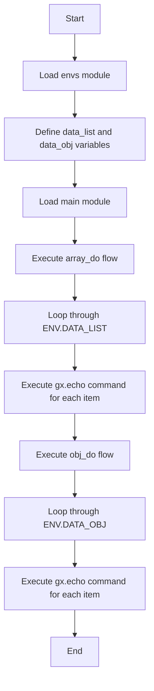

# Vars Example

This example demonstrates how to define and use variables in GXL.

```rust
mod envs {
    env default {
        data_list = [
            "JAVA",
            "RUST",
            "PYTHON",
        ];
        data_obj = {
            JAVA: { NAME: "JAVA", SCORE: 80 },
            RUST: { NAME: "RUST", SCORE: 100 },
            PYTHON: { NAME: "PYTHON", SCORE: 200 },
        };
    }
}

mod main {
    flow array_do {
        for ${CUR} in ${ENV.DATA_LIST} {
            gx.echo("CUR:${CUR}");
        }
    }
    flow obj_do {
        for ${CUR} in ${ENV.DATA_OBJ} {
            gx.echo("CUR:${CUR.NAME} : ${CUR.SCORE}");
        }
    }
}
```

## Description

This example shows how to define variables in an environment and how to use these variables in flows. In the `default` environment, a list `data_list` and an object `data_obj` are defined. In the `array_do` flow, the `data_list` list is iterated over and each element is output. In the `obj_do` flow, the `data_obj` object is iterated over and the properties of each object are output.

