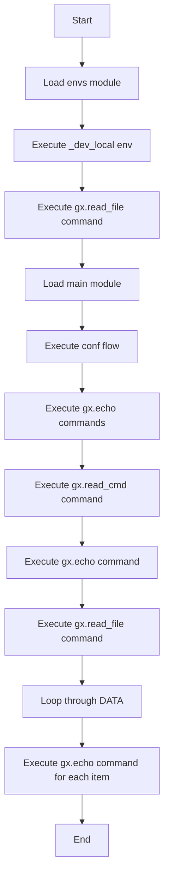

# Read 示例

## 示例代码

```rust
extern mod os { path= "../../_gal/mods"; }
mod envs {
    env _dev_local {
        gx.read_file ( file : "./var.ini" );
    }
    env default : _dev_local ;
}
mod main   {
  flow conf  {
    gx.echo (  "${RUST}" );
    gx.echo (  "${JAVA}" );
    gx.assert ( value : "${JAVA}" , expect : "90"  );

    gx.read_cmd (
        //fail!
        //cmd  : r#"git branch --show-current |  sed -E "s/(feature|develop|ver-dev|release|master|issue)(\/\.*)?/_branch_\1/g" "# ,
        //suc!
        cmd  : "git branch --show-current | sed -E 's/release/rls/g'" ,
        name : "GIT_BRANCH" );

    gx.echo ( "what:${GIT_BRANCH}" );

    gx.read_file ( file : "./var2.ini" , name : "DATA");

    for ${CUR} in ${DATA} {
        gx.echo ( value : "${CUR}" );
    }
  }


}
```



## 说明

这个示例展示了如何使用 `gx.read` 命令从不同来源读取数据。在 `_dev_local` 环境中，使用 `gx.read_file` 从 `var.ini` 文件读取数据。在 `conf` 流程中，使用 `gx.read_cmd` 执行 Git 命令并捕获输出，以及使用 `gx.read_file` 从 `var2.ini` 文件读取数据。还展示了如何遍历读取的数据。