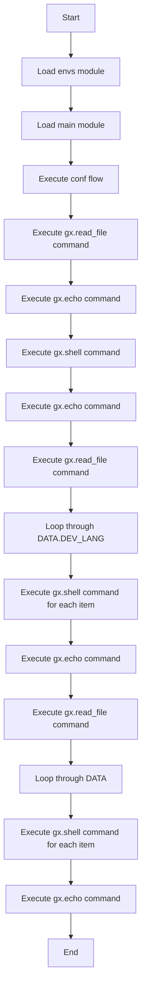

# Shell Example

This example demonstrates how to execute shell commands in GXL.

```rust
extern mod os { path = "../../_gal/mods"; }

mod envs {
    env _dev_local {}
    env default : _dev_local;
}

mod main {
    flow conf {
        gx.read_file(file: "./var.yml", name: "VAR");
        gx.echo("what:${VAR.MEMBER.JAVA}");

        gx.shell(
            arg_file: "./var.json",
            shell: "./demo.sh",
            out_var: "SYS_OUT");

        gx.echo("what:${SYS_OUT}");

        gx.read_file(file: "./var_list.yml", name: "DATA");
        for ${CUR} in ${DATA.DEV_LANG} {
            gx.shell(
                shell: "./demo_ex.sh ${CUR}",
                out_var: "SYS_OUT");
            gx.echo("what:${SYS_OUT}");
        }

        gx.read_file(file: "./var_obj.yml", name: "DATA");
        for ${CUR} in ${DATA} {
            gx.shell(
                shell: "./demo_ex.sh ${CUR.SYS.NAME}",
                out_var: "SYS_OUT");
            gx.echo("what:${SYS_OUT}");
        }
    }
    flow do_obj {
        gx.read_file(file: "./var_obj.yml", name: "DATA");
        for ${CUR} in ${DATA} {
            //gx.echo( "CUR:${CUR.SYS.NAME}" );
            gx.shell(
                shell: "./demo_ex.sh ${CUR.SYS.NAME}",
                out_var: "SYS_OUT");
            gx.echo("what:${SYS_OUT}");
        }
    }
}
```

## 说明

这个示例展示了如何使用 `gx.shell` 命令执行 shell 脚本。在 `conf` 流程中，首先从 `var.yml` 文件读取数据，然后使用 `gx.shell` 执行 `demo.sh` 脚本，并通过 `arg_file` 参数传递 `var.json` 文件。还展示了如何在循环中执行 shell 脚本，并处理列表和对象数据。

