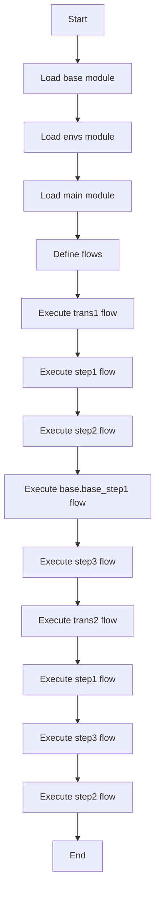

# Transaction Example

This example demonstrates how to use transactions in GXL.

```rust
extern mod base { path = "./_gal/"; }

mod envs {
    env default {};
}

mod main {
    flow trans1 | step1 | step2 | base.base_step1 | step3;
    flow trans2 | step1 | step3 | step2;

    #[transaction, undo(_undo_step1)]
    flow step1 {
        gx.echo(" step1 ");
    }
    #[undo(_undo_step2)]
    flow step2 {
        gx.echo(" step2 ");
    }
    #[undo(_undo_step3)]
    flow step3 {
        gx.echo(" step3 ");
        gx.assert(value: "true", expect: "false");
    }

    flow _undo_step1 {
        gx.echo(" undo step1 ");
    }
    flow _undo_step2 {
        gx.echo(" undo step2 ");
    }
    flow _undo_step3 {
        gx.echo(" undo step3 ");
    }
}
```

