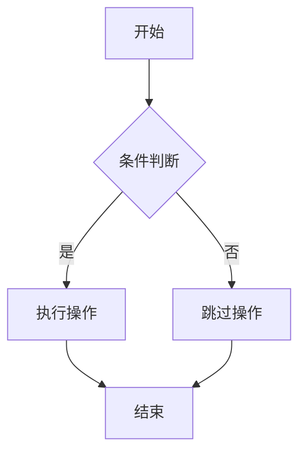
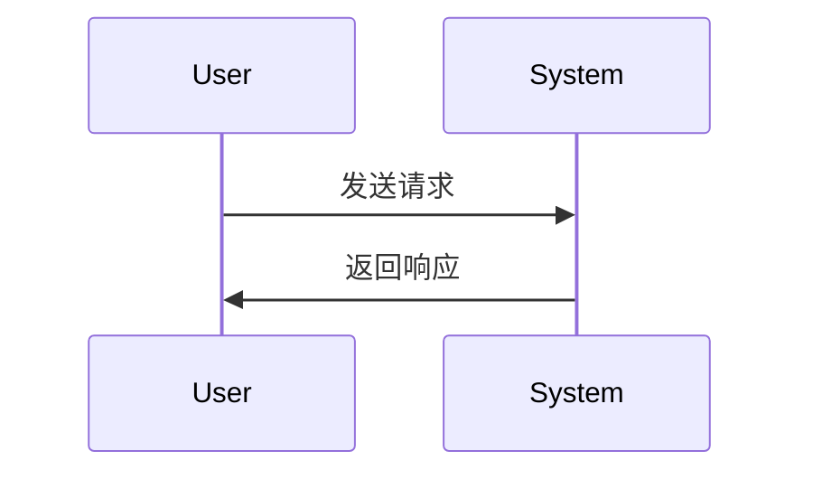
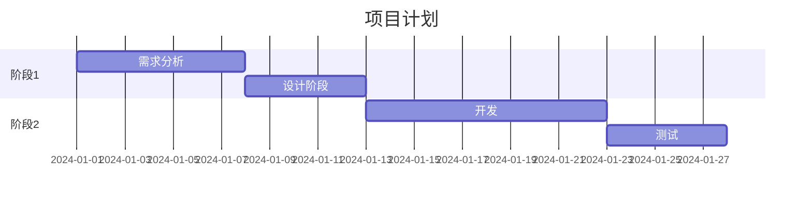

# Mermaid 图表测试

## 流程图测试

```mermaid
graph TD
    A[开始] --> B{条件判断}
    B -->|是| C[执行操作]
    B -->|否| D[跳过操作]
    C --> E[结束]
    D --> E
```

## 序列图测试

```mermaid
sequenceDiagram
    participant User
    participant System
    User->>System: 发送请求
    System->>User: 返回响应
```

## 甘特图测试

```mermaid
gantt
    title 项目计划
    dateFormat  YYYY-MM-DD
    section 阶段1
    需求分析    :2024-01-01, 7d
    设计阶段    :2024-01-08, 5d
    section 阶段2
    开发       :2024-01-13, 10d
    测试       :2024-01-23, 5d
```