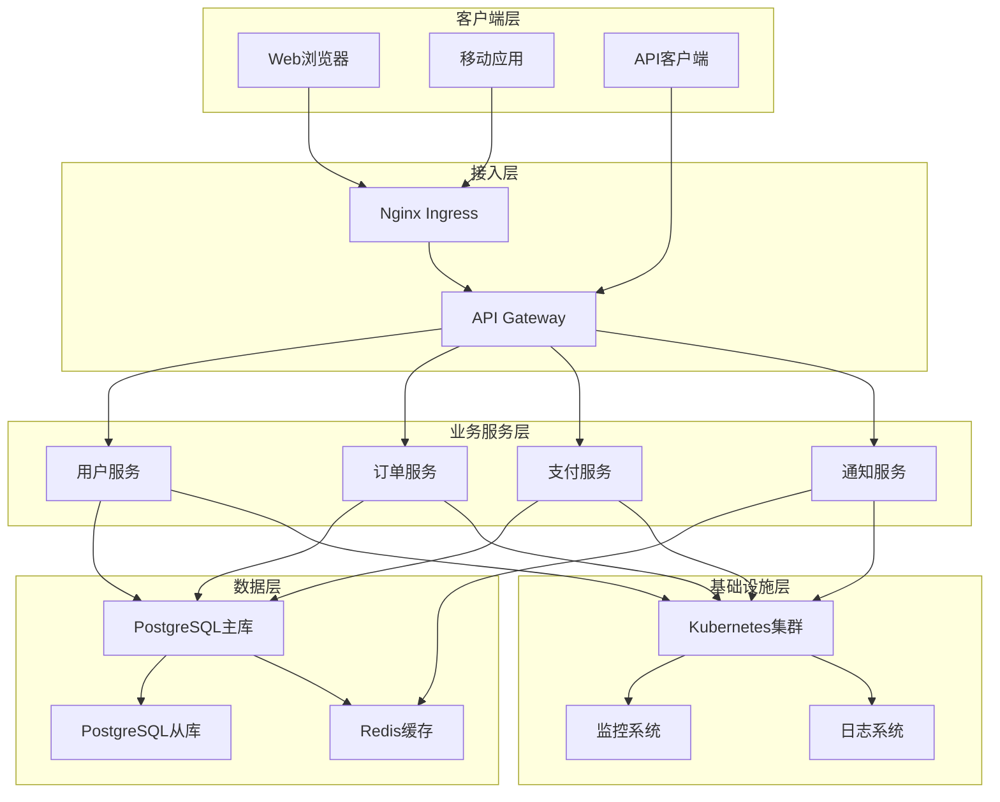

# 微服务系统示例

## 概述

本文档提供了一个完整的微服务系统示例，展示如何使用 Sys-Operator 构建和管理复杂的微服务架构。该示例包含 Web 前端、API 网关、用户服务、订单服务和数据库等多个模块，体现了现代微服务系统的典型架构模式。

## 系统架构

### 整体架构图



### 服务依赖关系

```
┌─────────────────┐    ┌─────────────────┐    ┌─────────────────┐
│   用户服务      │───▶│   订单服务      │───▶│   支付服务      │
│ (UserService)   │    │ (OrderService)  │    │ (PaymentService) │
└─────────────────┘    └─────────────────┘    └─────────────────┘
         │                       │                       │
         │                       │                       │
         ▼                       ▼                       ▼
┌─────────────────┐    ┌─────────────────┐    ┌─────────────────┐
│   PostgreSQL    │    │   PostgreSQL    │    │   PostgreSQL    │
│    主库         │    │    主库         │    │    主库         │
└─────────────────┘    └─────────────────┘    └─────────────────┘
         │                       │                       │
         ▼                       ▼                       ▼
┌─────────────────┐    ┌─────────────────┐    ┌─────────────────┐
│    Redis缓存    │    │    Redis缓存    │    │    Redis缓存    │
│ (用户会话)      │    │ (订单状态)      │    │ (支付状态)      │
└─────────────────┘    └─────────────────┘    └─────────────────┘
```

## 系统配置

### 1. 系统模型定义 (`sys/sys_model.yml`)

```yaml
# 系统基本信息
name: microservice_platform
model: x86-ubt22-k8s
vender: "TechCorp"


### 2. 模块列表配置 (`sys/mod_list.yml`)

```yaml
# 接入层模块
- name: nginx_ingress
  addr:
    repo: https://github.com/galaxy-operators/nginx
    tag: v1.25.3
  model: x86-ubt22-k8s
  enable: true


- name: api_gateway
  addr:
    repo: https://github.com/galaxy-operators/api-gateway
    tag: v3.0.0
  model: x86-ubt22-k8s
  enable: true
  priority: 90


# 用户服务模块
- name: user_service
  addr:
    repo: https://github.com/techcorp/user-service
    tag: v4.1.0
  model: x86-ubt22-k8s
  enable: true
  priority: 80


# 订单服务模块
- name: order_service
  addr:
    repo: https://github.com/techcorp/order-service
    tag: v3.5.0
  model: x86-ubt22-k8s
  enable: true


# 支付服务模块
- name: payment_service
  addr:
    repo: https://github.com/techcorp/payment-service
    tag: v2.8.0
  model: x86-ubt22-k8s
  enable: true


# 通知服务模块
- name: notification_service
  addr:
    repo: https://github.com/techcorp/notification-service
    tag: v1.6.0
  model: x86-ubt22-k8s


# 数据库模块
- name: postgres_primary
  addr:
    repo: https://github.com/galaxy-operators/postgresql-ha
    tag: v15.5.0
  model: x86-ubt22-k8s
  enable: true


- name: postgres_readonly
  addr:
    repo: https://github.com/galaxy-operators/postgresql-ha
    tag: v15.5.0
  model: x86-ubt22-k8s
  enable: true


# 缓存模块
- name: redis_cache
  addr:
    repo: https://github.com/galaxy-operators/redis-ha
    tag: v7.2.4
  model: x86-ubt22-k8s
  enable: true


# 外部服务模块
- name: external_payment_gateway
  addr:
    path: ./external-gateways/payment-gateway
  model: x86-ubt22-k8s


# 监控模块
- name: monitoring_stack
  addr:
    repo: https://github.com/galaxy-operators/enterprise-monitoring
    tag: v2.5.0
  model: x86-ubt22-k8s
  enable: true

```

### 3. 系统变量配置 (`sys/vars.yml`)

```yaml
# 系统配置
vars:
# 环境配置
- name: ENVIRONMENT
  value: "production"
  description: "部署环境"

- name: CLUSTER_NAME
  value: "${CLUSTER_NAME:production-cluster}"
  description: "Kubernetes集群名称"


- name: NAMESPACE
  value: "${NAMESPACE:microservices}"
  description: "Kubernetes命名空间"


# 应用配置
- name: APP_VERSION
  value: "2.3.0"
  description: "应用版本"


- name: DOMAIN_NAME
  value: "${DOMAIN_NAME:platform.techcorp.com}"
  description: "系统域名"


- name: BASE_URL
  value: "https://${DOMAIN_NAME}"
  description: "基础URL"


# 安全配置
- name: ENABLE_MTLS
  value: "${ENABLE_MTLS:true}"
  description: "启用双向TLS"
  type: boolean
  group: security

- name: API_RATE_LIMIT
  value: "${API_RATE_LIMIT:1000}"
  description: "API速率限制"
  type: integer
  min: 1
  max: 10000
  group: security

- name: SESSION_TIMEOUT_MINUTES
  value: "${SESSION_TIMEOUT_MINUTES:30}"
  description: "会话超时时间"
  type: integer
  min: 5
  max: 1440


# 数据库配置
- name: DATABASE_BACKUP_SCHEDULE
  value: "${DATABASE_BACKUP_SCHEDULE:0 1 * * *}"
  description: "数据库备份计划"


- name: DATABASE_RETENTION_DAYS
  value: "${DATABASE_RETENTION_DAYS:30}"
  description: "数据保留天数"
  type: integer
  min: 7
  max: 365


- name: CONNECTION_POOL_SIZE
  value: "${CONNECTION_POOL_SIZE:20}"
  description: "连接池大小"
  type: integer
  min: 1
  max: 100


# 缓存配置
- name: CACHE_DEFAULT_TTL
  value: "${CACHE_DEFAULT_TTL:3600}"
  description: "默认缓存TTL（秒）"
  type: integer
  min: 60
  max: 86400


- name: CACHE_MAX_SIZE
  value: "${CACHE_MAX_SIZE:10000}"
  description: "缓存最大条目数"
  type: integer
  min: 100
  max: 100000


- name: CACHE_REFRESH_INTERVAL
  value: "${CACHE_REFRESH_INTERVAL:300}"
  description: "缓存刷新间隔（秒）"
  type: integer
  min: 60
  max: 3600
  group: cache

# 消息队列配置
- name: MESSAGE_QUEUE_MAX_RETRIES
  value: "${MESSAGE_QUEUE_MAX_RETRIES:3}"
  description: "消息队列最大重试次数"
  type: integer
  min: 1
  max: 10
  group: messaging

- name: MESSAGE_QUEUE_DELAY_SECONDS
  value: "${MESSAGE_QUEUE_DELAY_SECONDS:60}"
  description: "消息队列重试延迟"
  type: integer
  min: 10
  max: 3600


# 高可用配置
- name: HIGH_AVAILABILITY_ENABLED
  value: "${HIGH_AVAILABILITY_ENABLED:true}"
  description: "启用高可用"
  type: boolean
  group: ha

- name: HEALTH_CHECK_INTERVAL_SECONDS
  value: "${HEALTH_CHECK_INTERVAL_SECONDS:30}"
  description: "健康检查间隔"
  type: integer
  min: 10
  max: 300

- name: FAILURE_DETECTION_SECONDS
  value: "${FAILURE_DETECTION_SECONDS:60}"
  description: "故障检测时间"
  type: integer
  min: 30
  max: 300
  group: ha

- name: AUTO_FAILOVER_ENABLED
  value: "${AUTO_FAILOVER_ENABLED:true}"
  description: "启用自动故障转移"
  type: boolean


# 性能配置
- name: DEFAULT_REPLICAS
  value: "${DEFAULT_REPLICAS:2}"
  description: "默认副本数"
  type: integer
  min: 1
  max: 10


- name: MAX_REPLICAS
  value: "${MAX_REPLICAS:10}"
  description: "最大副本数"
  type: integer
  min: 1
  max: 100


- name: CPU_REQUEST
  value: "${CPU_REQUEST:100m}"
  description: "CPU请求值"


- name: MEMORY_REQUEST
  value: "${MEMORY_REQUEST:256Mi}"
  description: "内存请求值"


- name: CPU_LIMIT
  value: "${CPU_LIMIT:2000m}"
  description: "CPU限制值"


- name: MEMORY_LIMIT
  value: "${MEMORY_LIMIT:4Gi}"
  description: "内存限制值"


# 监控配置
- name: MONITORING_ENABLED
  value: "${MONITORING_ENABLED:true}"
  description: "启用监控"
  type: boolean
  group: monitoring

- name: ALERT_EMAIL_RECIPIENTS
  value: "${ALERT_EMAIL_RECIPIENTS:devops-alerts@techcorp.com}"
  description: "告警邮件接收者"


- name: SLACK_WEBHOOK_URL
  value: "${SLACK_WEBHOOK_URL}"
  description: "Slack Webhook URL"


- name: PAGERDUTY_SERVICE_KEY
  value: "${PAGERDUTY_SERVICE_KEY}"
  description: "PagerDuty服务密钥"


# 业务配置
- name: BUSINESS_HOURS_START
  value: "${BUSINESS_HOURS_START:09:00}"
  description: "业务开始时间"


- name: BUSINESS_HOURS_END
  value: "${BUSINESS_HOURS_END:18:00}"
  description: "业务结束时间"


- name: MAINTENANCE_WINDOW_START
  value: "${MAINTENANCE_WINDOW_START:02:00}"
  description: "维护窗口开始时间"


- name: MAINTENANCE_WINDOW_END
  value: "${MAINTENANCE_WINDOW_END:04:00}"
  description: "维护窗口结束时间"


- name: FEATURE_FLAGS
  value: "${FEATURE_FLAGS:new-dashboard,advanced-analytics}"
  description: "功能开关"

```

### 4. 系统工作流配置 (`sys/workflows/operators.gxl`)

```rust
TODO
```

